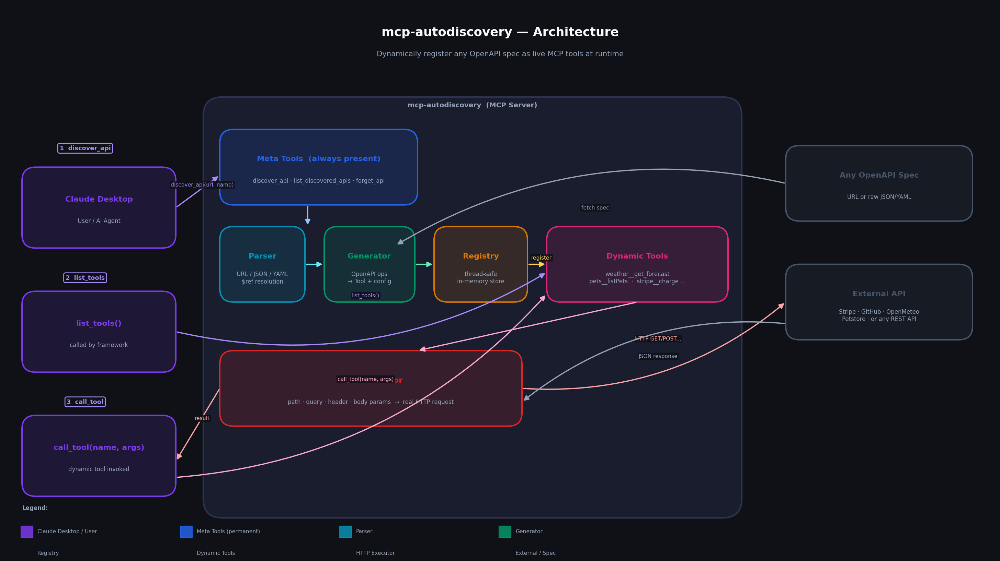

# mcp-autodiscovery

**An MCP server that turns any OpenAPI spec into live, callable tools — at runtime, with no restarts.**

Point it at any API's OpenAPI spec (URL or raw JSON/YAML). Every operation becomes an MCP tool instantly. Claude can then call those tools in the same conversation. No config changes, no code generation, no server restart.

---

## What makes this different

Most MCP servers ship with a fixed, hardcoded tool list. You add a new tool, you edit the source, restart the server.

`mcp-autodiscovery` implements `list_tools` dynamically — tools are added to the registry at runtime and appear in the next tool listing immediately. The agent can discover and use any API it has never seen before, within a single conversation.

---

## Architecture



### Flow summary

| Step | What happens |
|------|-------------|
| `discover_api(source, api_name)` | Fetches the spec → resolves `$ref`s → generates one `(Tool, config)` pair per operation → stores in registry |
| `list_tools()` | Returns the 3 permanent meta-tools **plus** every tool currently in the registry |
| `call any_tool(args)` | Looks up execution config → separates path / query / header / body params → fires the real HTTP request → returns the response |
| `forget_api(api_name)` | Removes all tools for that API from the registry |

---

## Project structure

```
mcp-autodiscovery/
├── src/
│   └── autodiscovery/
│       ├── server.py       # MCP server — dynamic list_tools & call_tool handlers
│       ├── parser.py       # Loads spec from URL or string, resolves $refs
│       ├── generator.py    # Converts OpenAPI operations → (Tool, config) pairs
│       ├── registry.py     # Thread-safe in-memory tool store
│       └── executor.py     # Builds & fires HTTP requests from tool arguments
├── catalog/
│   └── apis.yml            # Pre-configured API catalog (10 APIs, no/key auth)
├── tests/
│   ├── test_parser.py
│   └── test_generator.py
├── assets/
│   └── architecture.png    # Architecture diagram
├── run.py                  # Interactive catalog runner (pick an API, see it live)
├── demo.py                 # Single-API end-to-end demo
├── conftest.py             # Adds src/ to sys.path for pytest
├── requirements.txt
└── pyproject.toml
```

---

## Quickstart

### Prerequisites

- Python 3.11+
- pip

### Step 1 — Clone the repo

```bash
git clone https://github.com/Sourolio10/mcp-autodiscovery.git
cd mcp-autodiscovery
```

### Step 2 — Install dependencies

```bash
pip install -r requirements.txt
```

### Step 3 — Install the package

```bash
pip install -e .
```

### Step 4 — Run the interactive catalog

```bash
python run.py
```

Pick any API from the catalog and watch it get discovered and called live:

```
mcp-autodiscovery  API Catalog

  No API key required
  1  Open-Meteo Weather      Real-time weather forecasts worldwide.
  2  Petstore (Demo)         Classic Swagger demo API.
  3  JSONPlaceholder         Fake online REST API for testing.
  4  REST Countries          Country data — capitals, currencies, flags.
  5  PokéAPI                 The RESTful Pokémon API.
  6  Open Library (Books)    Search millions of books.

  API key required
  7  OpenAI API              GPT-4, DALL-E, Whisper, Embeddings.
  8  GitHub REST API         Repos, issues, PRs, users.
  9  Stripe Payments         Payments, subscriptions, refunds.
  10 Anthropic Claude API    Messages, models, token counting.

  Pick a number:
```

You can also pass the number directly as a CLI argument to skip the menu:

```bash
# No API key needed — run any of these directly
python run.py 1   # Open-Meteo Weather
python run.py 2   # Petstore Demo
python run.py 3   # JSONPlaceholder
python run.py 4   # REST Countries
python run.py 5   # PokéAPI
python run.py 6   # Open Library (Books)

# API key required — you will be prompted to enter your key
python run.py 7   # OpenAI
python run.py 8   # GitHub
python run.py 9   # Stripe
python run.py 10  # Anthropic Claude
```

Or run the single-API weather demo directly (no menu, no key):

```bash
python demo.py
```

Expected output:

```
------------------------------------------------------------
  STEP 1 - Loading OpenAPI spec
------------------------------------------------------------
  Source: https://raw.githubusercontent.com/open-meteo/open-meteo/main/openapi.yml
  Title:  Open-Meteo APIs
  Paths:  1

------------------------------------------------------------
  STEP 2 - Generating MCP tools from spec
------------------------------------------------------------
  1 tools registered:

    * weather__get_v1_forecast
      7 day weather forecast for coordinates
      params: latitude, longitude, hourly, daily, current ...

------------------------------------------------------------
  STEP 3 - Calling weather forecast tool (Atlanta, GA)
------------------------------------------------------------
  Calling: weather__get_v1_forecast
  Status code : 200
  Success     : True
  Location    : lat=33.759865  lon=-84.39586
  Temperature : 18.3 C
  Wind speed  : 11.2 km/h
  Time        : 2026-05-01T23:30

------------------------------------------------------------
  STEP 4 - Forgetting the API
------------------------------------------------------------
  Removed 1 tools.
  Tools remaining: 0
```

### Step 5 — Run the tests

```bash
python -m pytest tests/ -v
```

All 13 tests should pass.

---

## Connect to Claude Desktop

### Step 1 — Find your Claude Desktop config

| OS | Path |
|----|------|
| Windows | `%APPDATA%\Claude\claude_desktop_config.json` |
| macOS | `~/Library/Application Support/Claude/claude_desktop_config.json` |

### Step 2 — Add the server

Open the config file and add the `autodiscovery` block. Create the file if it doesn't exist.

**Windows:**
```json
{
  "mcpServers": {
    "autodiscovery": {
      "command": "python",
      "args": ["-m", "autodiscovery"],
      "cwd": "C:/path/to/mcp-autodiscovery/src"
    }
  }
}
```

**macOS / Linux:**
```json
{
  "mcpServers": {
    "autodiscovery": {
      "command": "python3",
      "args": ["-m", "autodiscovery"],
      "cwd": "/path/to/mcp-autodiscovery/src"
    }
  }
}
```

Replace the `cwd` path with the actual path to your cloned repo's `src/` folder.

### Step 3 — Restart Claude Desktop

Fully quit Claude Desktop (system tray → Quit) and reopen it.

### Step 4 — Verify

Click the tools icon (hammer) in the Claude Desktop chat input. You should see three tools:

- `discover_api`
- `list_discovered_apis`
- `forget_api`

---

## Example conversation with Claude

```
You: Load the Petstore API from https://petstore3.swagger.io/api/v3/openapi.json
     with api_name "pets" and base_url "https://petstore3.swagger.io/api/v3"

Claude: [calls discover_api] → 19 tools registered:
        pets__addpet, pets__findpetsbystatus, pets__getpetbyid ...

You: Find all available pets.

Claude: [calls pets__findpetsbystatus(status="available")]
        → returns live data from the Petstore API
```

The tools `pets__addpet`, `pets__findpetsbystatus`, etc. did not exist before you sent the first message.

---

## Supported features

| Feature | Status |
|---------|--------|
| OpenAPI 3.x (JSON) | Supported |
| OpenAPI 3.x (YAML) | Supported |
| Swagger 2.x | Partial (host + basePath resolution) |
| Internal `$ref` resolution | Supported |
| Path / query / header params | Supported |
| JSON request body (flat object) | Supported (properties flattened) |
| JSON request body (non-object) | Supported (exposed as `__body`) |
| API key auth | Supported (`auth_header` + `auth_value`) |
| Bearer token auth | Supported |
| Base URL override | Supported |
| Runtime tool registration | Supported |
| Runtime tool removal | Supported |

---

## Troubleshooting

| Problem | Fix |
|---------|-----|
| `ModuleNotFoundError: No module named 'autodiscovery'` | Run `pip install -e .` from the project root |
| Tools don't appear in Claude Desktop | Check the `cwd` path in config; fully quit and relaunch Claude |
| `python` not found in Claude Desktop | Use the full Python path, e.g. `C:/Users/you/AppData/Local/Programs/Python/Python311/python.exe` |
| API returns 500 or errors | The target API itself is failing — try a different public spec |
| Spec with relative server URL fails | Pass `base_url` explicitly to `discover_api` |

---

## Built with

- [MCP Python SDK](https://github.com/anthropics/mcp) — Model Context Protocol
- [httpx](https://www.python-httpx.org/) — async HTTP client
- [PyYAML](https://pyyaml.org/) — YAML spec parsing

---

## License

MIT
